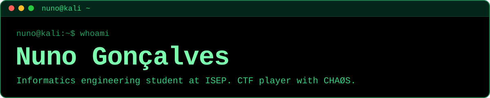

I study Informatics Engineering at ISEP in Porto, and this semester I'm on Erasmus at Aarhus University. Outside class I play CTFs with CHAØS, ISEP's team, mostly forensics, reverse engineering and pwn.

I'm available from February 2027 for a curricular internship in cybersecurity, February to June.

## Certifications

   
  Cisco Certified Network Associate, certified in August 2026

   
  Certified Ethical Hacker course at ISEP Academy, February to July 2026

   
  AWS fundamentals course at ISEP Academy, October 2025 to January 2026

   
  English language certificate. Portuguese is my native language

## Competitions and awards

- Cybersecurity Challenge PT 2026: one of the 15 juniors selected for the national bootcamp (National Cybersecurity Centre), finished in the junior top 10
- upCTF 2026: 8th of more than 300 teams with CHAØS, in my first CTF
- Best Project Award at ISEP for *All Aboard*, the first-year integrative project

## On GitHub

  

## Projects

Most of my coursework and competition projects live in private repositories, so here's what I built and how much of it was mine. The two public ones link to their code.

| Project | What it is | Main languages | My commits | When |
|---|---|---|---|---|
| **[Wakecast](https://github.com/NunoGoncalves06/Wakecast)** | Android alarm with a morning briefing: weather, your day and the news read out when you dismiss the alarm. On-device voices, no accounts | Java | 21 of 21, solo | 2026 |
| **[Alchemist's Arsenal](https://github.com/NunoGoncalves06/alchemists-arsenal)** | Unity game project | C# | 3 of 6, team of 2 | 2026 |
| **IoT sensor node** | Group IoT project in its design phase: an ESP32-C6 board with a VL6180X distance sensor, publishing readings over MQTT | ESP32-C6, MQTT | team member, in progress | 2026 |
| **AISafe** | Flight control management prototype: Java console apps, a flight-plan DSL parsed with ANTLR, a C simulation engine, and user roles with security clearances | Java, C, Python | 117 of 627, team of 5 | 2025/26, 4th semester |
| **LAPR3 integrative project** | Java application with C, C++ and Assembly modules and a PL/SQL database, including algorithm complexity analysis | Java, C, C++ | 167 of 665, team of 4 | 2025/26, 3rd semester |
| **JPA persistence demo** | Java console app persisting its domain objects with JPA (EclipseLink) on an H2 database, built for the EAPLI course | Java | 2 of 4, team of 2 | 2025/26 |
| **CCNA 3 enterprise network** | Final project of CCNA 3 (ENSA), built on real Cisco equipment and awarded the maximum score. A three-site network with VLANs, OSPF, HSRP, an IPsec VPN and IP telephony, plus Ansible playbooks that apply base configuration to the routers and back them up | Cisco IOS, Ansible, YAML | team member | 2025/26 |
| **European stations dataset** | Python collector that merges railway stations and airports across Europe from OpenStreetMap and OurAirports into one CSV, with duplicate detection (built with Copilot's help) | Python | 3 of 3, solo | 2025 |
| **All Aboard (Best Project Award)** | First-year integrative project covering every first-year module: a Java application built through a full development process (requirements, OO analysis and design, unit tests with coverage) plus data analysis in Jupyter | Java, Python | 115 of 539, team of 5 | 2024/25, 2nd semester |
| **Sueca bot tournament (ENEI)** | Competition bots for Sueca, the Portuguese card game, running in Docker containers against other teams | Java, JavaScript, Python | top contributor | 2025 |
| **Face identification with Eigenfaces** | Face identification and image reconstruction using Eigenfaces (PCA), written in Java | Java | 82 of 145 (top contributor), team of 5 | 2024/25, 1st semester |
| **EV fleet charging analysis** | Java console program that reads electric-vehicle mileage data and works out daily recharges, battery levels, charging costs and above-average vehicles (APROG assignment) | Java | 39 of 49 (top contributor), team of 2 | 2024/25, 1st semester |
| **QuintinhaVirtual website** | Business-card website for a fictional organic farm shop, customised from an HTML template | HTML, SCSS, JavaScript | 13 of 15 (top contributor), team of 2 | 2024/25, 1st semester |

## What I work with

| Area | Tools |
|---|---|
| Programming |  |
| Cloud and tooling |  |
| Web and game dev |  |
| Security | Wireshark, Burp Suite, Hydra and Ghidra. CTFs, mostly forensics, reverse engineering, pwn and misc. CEH training completed |
| Networking | Routing, switching and network fundamentals (CCNA) |
| Languages | Portuguese (native), English (C1, IELTS Academic) |

## Education and experience

- BSc in Informatics Engineering at ISEP, Porto, 2024 to 2027, with an Erasmus semester at Aarhus University in autumn 2026
- CHAØS, ISEP's CTF team: member since February 2026
- NEI-ISEP, ISEP's informatics student association: External Relations, October 2025 to July 2026. I contacted companies about sponsorships and helped organise GameJam and CodeSpring

Cards drawn daily by <a href="https://github.com/lowlighter/metrics">lowlighter/metrics</a>.
